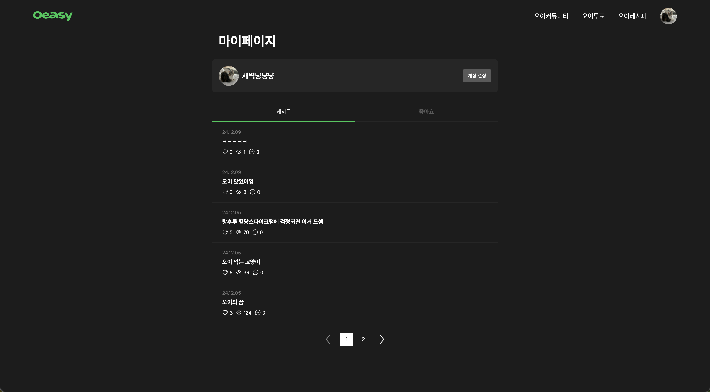

    
# 🔥사이드 프로젝트🔥

    
| 인원 | FE 임현아 서샛별 박수미 / BE 김현빈 박진수 / DGN 구현경 |
| :---: | :-- |
| 개발 기간 | 2024-10-15 ~ 2024-12-18 |
| 프로젝트 명 | Oeasy |
| 주제 | 호불호가 심한 채소인 오이를 주제로 다양한 정보를 제공하고 소통할 수 있는 커뮤니티 사이트입니다. |
| 사이트링크 | https://oeasy.world |

<h3 align="center">✨ Tech Stack ✨</h3>

  
  &nbsp
   
  &nbsp 
  
  &nbsp
  &nbsp
   

## 시스템 아키텍쳐

    

    
## 📍주요 기술

### 로그인 ( 소셜 로그인 kakao)
> * kakao와 Email을 통한 로그인이 가능합니다

미리보기

  

### 마이페이지
> * 회원정보 수정, 로그아웃, 회원탈퇴가 가능합니다.
> * 내가 쓴 게시물과 좋아요한 게시물을 불러옵니다.

미리보기

  

### Main
> * 오이와 관련된 전문지식, 날씨에 따른 오이 상태변화, 지역별 가격, 이번달 가격, 오이 레시피를 확인할 수 있습니다.

미리보기

  

### AI-OE(ChatJPT)
> * 오이와 관련된 정보를 질문하고 답변을 받을 수 있습니다.

미리보기

  

### 오이 커뮤니티
> * 자유롭게 게시물 및 댓글을 작성할 수 있습니다.
> * 최신순, 인기순, 오래된 순으로 글을 정렬할 수 있습니다.
> * 조회수와 좋아요를 확인할 수 있습니다.
> * 특정 게시물을 검색을 통해 찾을 수 있습니다.

미리보기

  

### 오이 투표와 채팅
> * 하루에 한번 투표할 수 있습니다.
> * 유저들의 투표수 현황을 확인 할 수 있습니다.
> * 사이트에 접속한 유저들이 서로 실시간 채팅을 할 수 있습니다.

미리보기

  

### 오이 레시피
> * 오이가 들어간 레시피를 무한 스크롤을 통해 볼 수 있습니다.
> * 특정 레시피를 좋아요할 수 있습니다.
> * 검색을 통해 원하는 레시피를 찾을 수 있습니다.

미리보기

  

  

## 🍀기술적 의사결정

### ◻ React - Typescript

> 코드 스플리팅과 서버 사이드 렌더링을 통해 필요한 페이지에 한해 초기 로딩 속도를 줄이고, App Routing과 같은 개발자가 쉽게 사용할 수 있는 라우팅 방식을 이용하기 위해 선택했습니다.

### ◻ Tanstack query

> 제품 목록, 사용자 정보, 등 다양한 데이터 페칭이 필요한 상황에서 불필요한 네트워크 요청을 줄여 성능을 최적화하고 필요한 곳에 전역적으로 서버 상태를 관리하기 위해서 선택했습니다.

### ◻ Zustand

> 장바구니, UI 상태을 관리하기 위해 보일러 플레이팅이 적고 확장성을 갖춘 전역 관리 라이브러리인 zustand를 선택했습니다.

### ◻ tailwindcss

> 처음부터 스타일을 작성하는 것이 아닌 사전에 정의된 유틸리티 클래스를 사용하여 스타일을 빠르게 적용할 수 있고, 사용하지 않는 스타일을 제거하는 특징 또한 가지고 있기에 선택했습니다.

  

### [👊 Oeasy 노션 바로가기](https://www.notion.so/11cedee0214880e8baece311bb09fce5)

